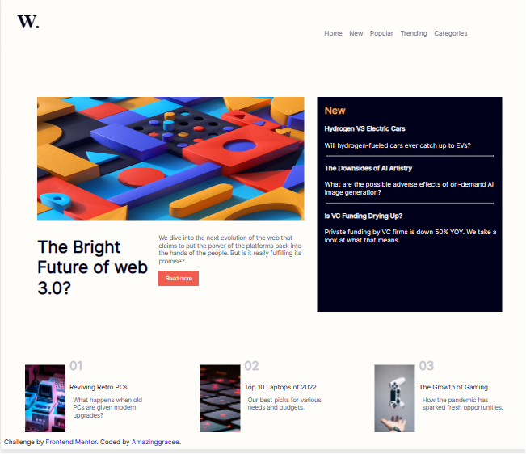

# Frontend Mentor - News homepage solution

This is a solution to the [News homepage challenge on Frontend Mentor](https://www.frontendmentor.io/challenges/news-homepage-H6SWTa1MFl). Frontend Mentor challenges help you improve your coding skills by building realistic projects. 

## Table of contents

- [Overview](#overview)
  - [The challenge](#the-challenge)
  - [Screenshot](#screenshot)
  - [Built with](#built-with)
- [Author](#author)
- [Acknowledgments](#acknowledgments)

**Note: Delete this note and update the table of contents based on what sections you keep.**

## Overview

### The challenge

Users should be able to:

- View the optimal layout for the interface depending on their device's screen size
- See hover and focus states for all interactive elements on the page

### Screenshot



### Built with

- Semantic HTML5 markup
- CSS custom properties
- Flexbox
- CSS Grid
- Mobile-first workflow
- javaScript

### What I learned

I learnt how to manipulate DOM and how to use media query for different screen display. 

To see how you can add code snippets, see below:

```html
<li>
          <a class="menuItem" href="#portfolio" onclick="toggleMenu()">Home</a>
        </li>

```
```css
.showMenu {
  width: 78vh;
  height: 100vh;
  transform: translateY(0);
  display: flex;
  flex-direction: column;
  gap: 17px;
  height: 100vh;
  border-radius: 0;
  padding-top: 69px;
  align-items: left;
  margin-top: 0%;
  margin-left: 12%;
  margin-right: -20%;
  background-color: var(--Off-white);
}


### Continued development


## Author
- [GitHub Pages](https://pages.github.com/Amazinggracee)
- [Vercel](https://vercel.com/amazinggracee)
- [Netlify](https://www.netlify.com/Amazinggracee)
- Frontend Mentor - [](https://www.frontendmentor.io/profile/Amazinggracee)
- Twitter - [@yourusername](https://twitter.com/amazinggraceu)


## Acknowledgments

I am so  grateful to ; firstly, Frontend Mentors . I also acknoledge my personal rabbi, Elotide for being a good teacher.
